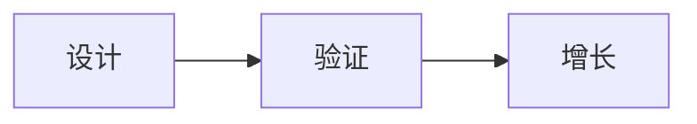

# 关于创业

:::success notion
本文是对《精益创业实战》的一些学习笔记和整理。
:::

> 今天,投资人看重的不是知识产权,而是增长力。增长力不在于是否率先进入市场,而在于是否率先被市场广泛接受。具备增长力证明除了你自己、你的团队和你的亲朋好友之外,还有人关心你的创业想法,即客户。更重要的是,增长力也证明了你的商业模式行之有效。

1. 商业模式就是产品
2. 你应该爱上的是客户的问题，而非自己的解决方案
3. 创业的目标是获取增长力

你可能会认为下面的这一点违反常理:不需要可行的产品,甚至不需要第一批付费客户,就可以发现值得解决的问题。

拉里和史蒂夫不同,后者在着手创业一年后仍在完善和打磨他的产品,而拉里在不到8周的时间内就定义了自己的最小化可行产品(minimum viable product,MVP),而且获取客户的渠道在不断增加。

本书概述了这一循序渐进的系统化过程，帮助你从最初的创业点子所点燃的火花开始，一路向前，直到最终实现产品与市场相契合。这个过程分为 3 个部分。

1. 设计：关键在于需要具备正确的思维模式，即创业公司的真正产品并非你提供的解决方案，而是你的商业模式。谈到产品的时候，第一步永远都是设计。
按照一定的流程，将自己最初的愿景（或最初计划）解构为一个商业模式。然后对自己的商业模式设计进行压力测试，避免那些最常见的让早期产品夭折的陷阱。最后，将你的想法清晰简洁地传达给他人，让他们明白你的想法，“见你所见”。

2. 验证：虽然从商业模式的蓝图入手是让创业思路更加清晰、焦点更加突出的关键，但重要的是，你要认识到所有的商业模式都是现实的抽象，而非现实本身。换句话说，必须用实证来验证而非仅靠空想或者信念。以 90 天为一个周期，分阶段反复测试自己的商业模式，并从第一个验证阶段入手，即问题与解决方案相匹配阶段。你将学会如何使用“演示–销售–构建”这一过程来测试客户对你产品的需求，并在无须先行开发产品的情况下获得付费客户。

3. 增长：实现问题与解决方案相匹配，可以让你做好一切准备，开发你已经知道客户会购买的产品，而非在开发产品之后寄希望于客户会购买。下一步就是发布自己的产品（最小化可行产品），然后不断迭代，最终实现产品与市场相契合。最大限度地提高你的产品推出速度和学习效果，同时持续关注各种假设中风险最高的假设。你将学习如何首先基于不同阶段小规模地测试你的商业模式，并在实现增长之前实现可重复性，而不是向所有人发布你的产品。

## 设计

我们生活的时代为创新提供了无可比拟的机会。随着互联网、云计算和开源软件的出现，打造产品的成本已经降至历史最低点。然而，建立成功的创业公司的概率并没有提高多少，大多数新产品依旧会以失败收场。

更有趣的事实是，在获得成功的创业公司中，有三分之二的公司表示它们的创业计划在中途发生了巨大变化。这些创业公司之所以能够成功，并不一定是因为它们有着优于其他创业公司的初始计划（或 A 计划），而是因为在资源耗尽之前它们找到了行之有效的方案。

客户采用的曲线并非简单的一条曲线，因为每个客户群体采用解决方案的速度不同，所以客户采用的曲线是多条曲线组成的一系列曲线。在发布产品之前，你需要深刻理解到底谁是你的客户以及他们想要什么（或者将来想要什么）。很可能你会发现你的目标客户根本不需要你要推出的产品。自此，你需要不断迭代，才能满足客户需求，达到产品与市场相契合（product/market fit），这可能会与你最初规划的产品完全不同（需要“转型”）。

理想中富有远见的产品推出都是完美命中目标，但是实际情况是，我们开始的起点要么在客户采用曲线的左边（太早），要么在右边（太迟），但是只要我们了解曲线的走向，并且在迭代机会（现金）耗尽之前让自己的产品进入正轨即可。

要想把一个灵感的潜力全部挖掘出来，你必须要有激情和决心，但如果对这两点不加以限制，创业又会变成对信念的盲目追求。

聪明的人总是对自己的想法非常自信，创业者更是如此。

虽然对自己的愿景深信不疑可以创造良好的创业氛围，但是你应该努力摆脱信念的影响，更多地依靠事实说话。你必须接受一个事实，那就是创业之初的理念大部分是建立在未经测试的假设或者猜想之上，明白这一点非常重要。

:::success 关于商业计划书
写作时间过长

为了让别人为你的创意亮起绿灯，你通常会被要求撰写一份长达 30 页的商业计划书，对未来 5 年的财务状况做出预测，然后创建为期 18 个月的产品路线图。这些工作至少会占用你几周的时间，多则几个月。

内容充其量只是最佳猜测

创业者和创新者之所以选择放弃重量级的商业计划书，并不是因为他们懒惰。相反，这是因为在任何新项目的初始阶段，许多假设的结果都是未知的。
:::

开展复杂项目就像建造一座房子，我们绝不会从砌墙入手。我们率先进行的工作肯定是制订建筑计划或者绘制相关蓝图——即便只是绘制草图。

构思或者实施某个想法也不例外。

创建精益画布草图的过程就像拼图一样，没有正确的起点，也没有特定的顺序，所以你可以从最了解的部分开始，以此为起点构建画布的其他部分。如果你还不确定该如何进行，可以按照下图中的顺序绘制。

如果你的商业模式中有多个行为者，那么必须找出哪些是真正的客户。

由于持续创新框架在很大程度上关注的重心是客户，因此先填写精益画布中的“客户群体”（customer segment）这一栏是很自然的事情。

为产品掏腰包的人才叫客户（customer），一般的用户（user）则不会这么做。对于搜索引擎来说，客户是广告商，而用户是使用搜索引擎进行搜索的人。

你的目标是定义典型的早期采用者，而不是主流客户。

你的客户群体应该覆盖商业创意所针对的总潜在市场（total addressable market，TAM），而你的早期采用者应该代表潜在市场的一个子集。这是你理想的初始客户群体（也被称为“理想客户画像”）。

