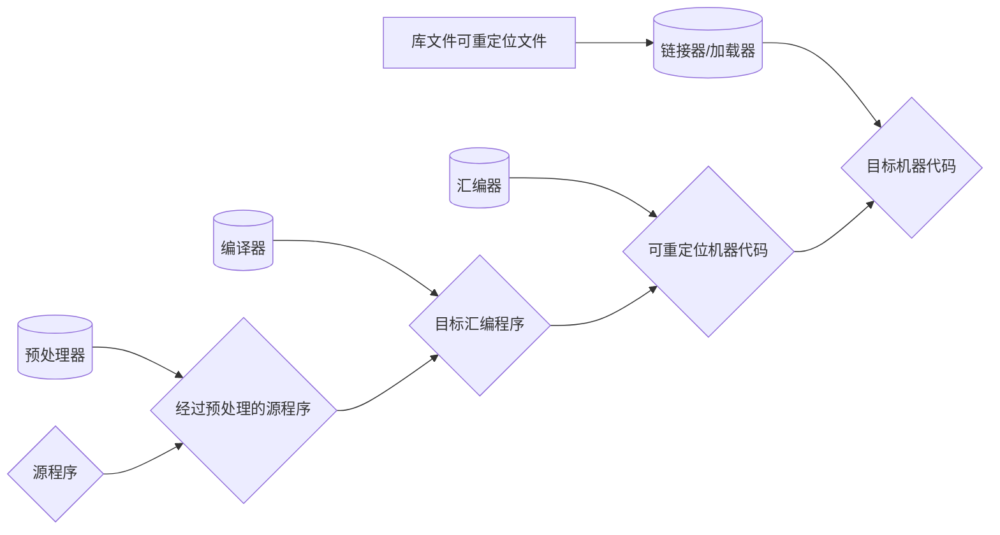
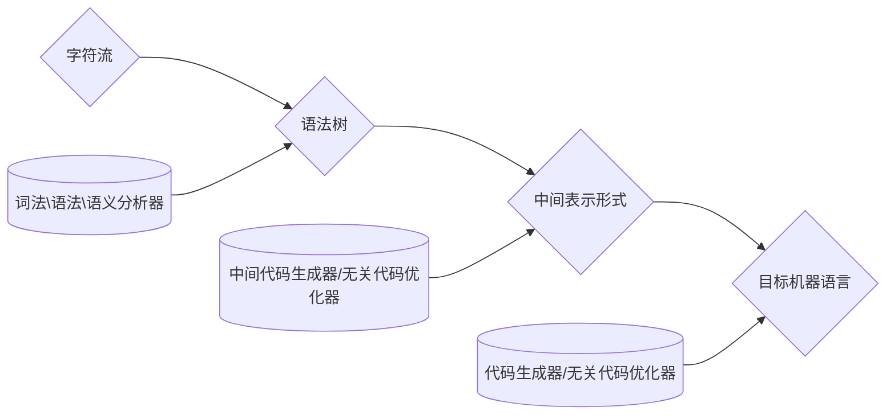

# fundamentals_of_compiling

:::info 编译器

程序设计语言是向人以及计算机描述计算过程的记号.但是,在一个程序运行之前,它首先要被翻译成一种能够被计算机执行的形式.完成这项翻译工作的软件系统成为编译器`compiler`.

简单的说,编译器就是可以阅读某一种语言编写的程序的程序,并把该程序翻译成另一种语言的等价程序.编译器的重要任务之一:报告它在翻译过程中发现的源程序中的错误.如果目标程序是一个可执行的机器语言程序,那么他就可以被用户调用,处理输入并产生输出.

解释器是另一种常见的语言处理器.解释器的错误诊断效果比编译器好,因为它是逐个语句地执行源程序.除了编译器,创建一个可执行的目标程序还需要其他程序.一个源程序可能被分割成为多个模块,并存放于独立的文件中.把源程序聚合在一起的任务有时会由一个预处理器`preprocessor`的程序独立完成,预处理器还负责把宏的缩写形式转换为源语言语句.

预处理后的源程序作为输入传入编译器,输出一个汇编语言程序.

汇编语言程序经过汇编器`assembler`处理生成可重定位的机器代码.

大型程序经常被分为多个部分进行编译,因此,可重定位的机器代码有必要和其他可重定位的目标文件以及库文件连接在一起,形成真正在机器上运行的代码.一个文件(这里的文件指的是二进制文件,和预处理器连接的文件不是一种文件)可以指向另一个文件中的位置.而链接器`linker`能够解决外部内存地址的问题,最后加载器`loader`把所有的可执行目标文件放到内存中执行.

:::

> 经过预处理的源程序仍然是高级语言程序.

编译程序：将高级语言的源程序翻译成与之等价的低级语言的目标程序的这样一种程序

源程序运行过程：编译阶段+运行阶段或者编译阶段+汇编阶段+运行阶段

解释程序：以源程序作为输入，但不产生目标程序，解释一条执行一条

汇编程序：用于特定计算机上的汇编语言的翻译程序。有时编译器把汇编语言作为目标语言，然后再由汇编程序将它翻译成目标代码。

连接程序：将分别在不同的目标文件中编译或汇编的代码收集到一个可直接执行的文件中

装入程序：编译器、汇编程序或连接程序生成的代码还不能运行，装入程序处理所有的与指定的基地址有关的可重定位地址，并将修改后的指令和数据放在内存中适当的位置。

预处理程序：预处理程序是在真正的编译开始之前由编译器调用的独立程序。预处理程序可以删除注释、包含其它文件以及执行宏替代。

源程序+初始数据→解释程序→计算结果

源程序→编译程序→初始数据+目标程序+运行系统子程序→计算结果

## 编译过程

表格管理程序：登记源程序的各类信息和编译程序各阶段的进展情况，如符号表。

出错处理程序：发现并指出源程序中错误的性质和位置；自动校正错误

遍：对源程序或源程序的中间结果从头至尾扫描一次，并作有关的加工处理，生成新的中间结果或目标程序的处理过程称为一遍。可以把一个阶段分为若干遍，也可以把多个阶段合为一遍，通常有一遍和多遍编译程序。

前端（front end）：由与源语言有关但与目标机无关的部分组成。

后端（back end）：包括与目标机有关的部分。而一般不依赖于源语言，只与中间代码有关的编译阶段。

编译器看作是一个黑盒子，将源程序映射为在语义上等价的目标程序。黑盒子内的映射部分由两个部分组成：前端(分析)和后端(综合)。
一般分为5个阶段：词法分析→语法分析→语义分析与中间代码产生→优化→目标代码生成

词法分析：按照语言的词法规则使用特定的工具将源程序转换成单词符号串
语法分析：按照语法规则使用上下文无关文法、确定的下推自动机将单词符号串转换为各类语法范畴 （层次结构分析）
语义分析与中间代码产生：按照语义规则使用属性文法将语法范畴进行初步翻译、产生中间代码（中间代码即独立于具体硬件的记号系统，四元式、三元式、逆波兰式等。）
优化：按照等价变换规则使用变换方法将中间代码变为更高效的中间代码
目标代码生成：将中间代码转换成依赖于机器的目标代码

