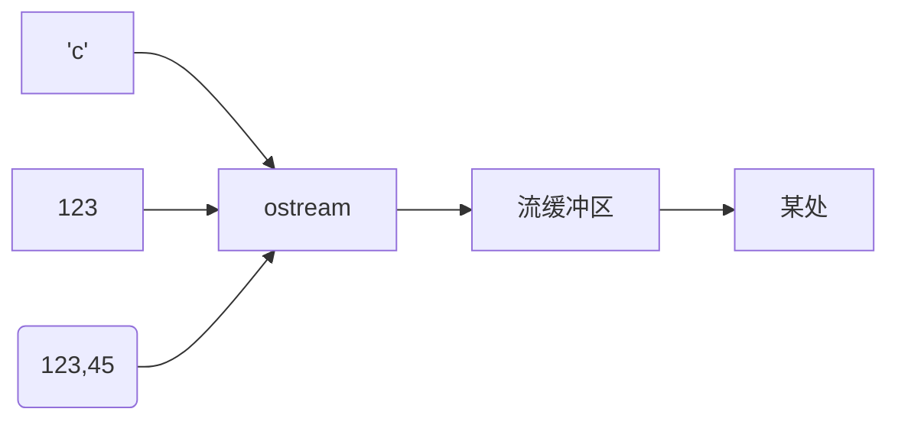
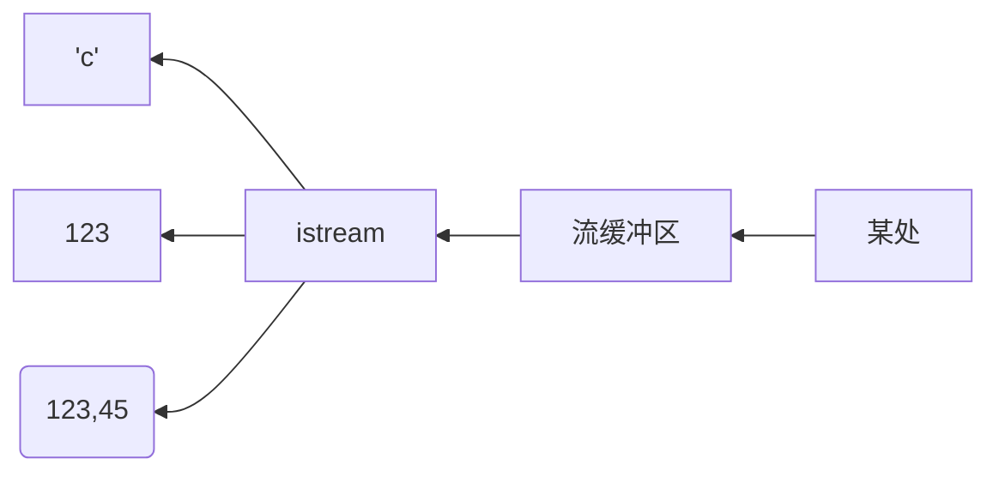

# IO

C++ comes with libraries that provide us with many ways for performing input and output. In C++ input and output are performed in the form of a sequence of bytes or more commonly known as streams.

Input Stream: If the direction of flow of bytes is from the device(for example, Keyboard) to the main memory then this process is called input.
Output Stream: If the direction of flow of bytes is opposite, i.e. from main memory to device( display screen ) then this process is called output.

Header files available in C++ for Input/Output operations are: 

1. iostream: iostream stands for standard input-output stream. This header file contains definitions of objects like cin, cout, cerr, etc.
2. iomanip: iomanip stands for input-output manipulators. The methods declared in these files are used for manipulating streams. This file contains definitions of setw, setprecision, etc.
3. fstream: This header file mainly describes the file stream. This header file is used to handle the data being read from a file as input or data being written into the file as output.
4. bits/stdc++: This header file includes every standard library. In programming contests, using this file is a good idea, when you want to reduce the time wasted in doing chores; especially when your rank is time sensitive. To know more about this header file refer this article.

IOstream库提供了文本和数值的io功能, 这种输出是带缓冲的,可以是格式化的,也可以是未格式化的.

ostream对象将有类型的对象转换为一个字符(字节)流:

istream对象将一个字符(字节)流转换为有类型的对象:

:::success 信息
图形化io是通过相应的库来处理的, 这些库并不是iso标准库的一部分, 因此本书并未涉及.

标准库流可用于二进制io,不同字符类型,不同区域设置,使用高级缓冲策略等等(不讨论).

标准库流可以对std::string进行输入输出, 对string缓冲区进行格式化输入输出以及进行文件io

所有io流类都有析构函数, 用来释放拥有的所有资源(如缓冲区和文件句柄).
:::
