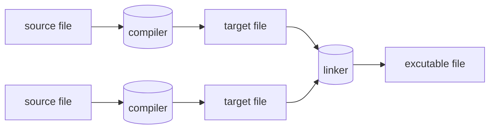

# 简介

import {To} from '@components'

:::success 版本
从 C++98 的出现到 C++11 的正式定稿经历了长达十年多之久的积累。C++14/17 则是作为对 C++11 的重要补充和优化，C++20 则将这门语言领进了现代化的大门，所有这些新标准中扩充的特性，给 C++ 这门语言注入了新的活力。

现代 C++ (指 C++11/14/17/20) 为传统 C++ 注入的大量特性使得整个 C++ 变得更加像一门现代化的语言。现代 C++ 不仅仅增强了 C++ 语言自身的可用性，auto 关键字语义的修改使得我们更加有信心来操控极度复杂的模板类型。同时还对语言运行期进行了大量的强化，Lambda 表达式的出现让 C++ 具有了『匿名函数』的『闭包』特性，而这一特性几乎在现代的编程语言（诸如 Python/Swift/... ）中已经司空见惯，右值引用的出现解决了 C++ 长期以来被人诟病的临时对象效率问题等等。
:::

标准的 C++ 由三个重要部分组成：

1. 核心语言，提供了所有构件块，包括变量、数据类型和常量等等。
2. C++ 标准库，提供了大量的函数，用于操作文件、字符串等。
3. 标准模板库（STL），提供了大量的方法，用于操作数据结构等。

:::success ANSI 标准
ANSI 标准是为了确保 C++ 的便携性 —— 您所编写的代码在 Mac、UNIX、Windows、Alpha 计算机上都能通过编译。
由于 ANSI 标准已稳定使用了很长的时间，所有主要的 C++ 编译器的制造商都支持 ANSI 标准。
:::

### 程序

一个 C++ 程序是一个含有声明的文本文件（通常为头文件与源文件）序列。它们被翻译成一个可执行程序，C++ 实现通过调用其主 (main) 函数执行这一程序。

在 C++ 程序中，一些被称为关键词的词语有着特殊的含义。其它词语可以被用作标识符。在翻译的过程中，注释会被忽略。C++ 程序也包含字面量，其中的字符的值由字符集与编码指定。程序中的某些特定字符必须通过转义序列表示。

C++ 程序中的实体entity包括值、对象、引用、结构化绑定`C++17`、函数、枚举项、类型、类成员、模板、模板特化、形参包`C++11`和命名空间。预处理器宏不是 C++ 实体。

声明可以引入实体，将它们与名字关联起来，并定义其属性。能够定义使用一个实体所需的所有属性的声明是定义。对任何被 ODR 使用的非内联函数或变量，程序中必须只含有其一个定义。

函数的定义通常包括一系列的语句，其中部分会包含表达式。表达式指定了程序需要进行的运算。

程序中遇到的名字通过名字查找与引入它们的声明关联起来。每个名字都只在称为其作用域的程序部分中有效。有些名字有链接，这使得它们即使出现在不同的作用域或翻译单元时也代表相同的实体。

C++ 中的每一个对象、引用、函数和表达式都会关联一个类型。类型可以分为基础类型，复合类型，或用户定义类型，以及完整或不完整的类型等。

被声明的且不是非静态数据成员的对象和引用是变量。

C++是一种编译型语言。为了让程序运行,首先要用编译器处理源代码文本,生成目标文件,然后再用连接器将目标文件组合成可执行程序。一个C++程序通常包含多个源代码文件,通常简称为源文件(source file)。

可执行程序都是为特定的硬件系统组合创建的。不具有可移植性。比如Mac上的程序就无法移植到Windows PC上。当谈论C程序的可移植性时，谈论的是源代码的可移植性。即源代码可以在不同系统上成功编译并运行。

ISO的C++标准定义了两类实体：
1. 核心语言特性(core language feature),例如内置类型(如char和int)和循环(如for语句和while语句);
2. 标准库组件(standard-library component),比如容器(如vector和map)和I/O操作(如\<\<和getline())。

每个C++实现都提供标准库组件，它们其实也是非常普通的C++代码。换句话说，C++标准库可以用C++语言本身实现(仅在实现线程上下文切换这样的功能时才使用少量机器代码)。这意味着C++在面对大多数高要求的系统编程任务时既有丰富的表达力，同时也足够高效。
C++是一种静态类型语言，这意味着任何实体(如对象、值、名称和表达式)在使用时都必须已被编译器了解。对象的类型决定了能在该对象上执行的操作。

## 预处理器

预处理器在编译前的翻译阶段 4 执行。预处理的结果是单个文件，接下来它会被传递给实际编译器。

## 参考

<To name="cppreference.com" to="https://en.cppreference.com"/>
<To name="Awesome C++" to="https://cpp.libhunt.com"/>
<To name="learncpp" to="https://www.learncpp.com"/>
<To name="代码巴士 - 分享有价值的 C/C++ 知识和源代码" to="https://codebus.cn/"/>
<To name="C语言与C++学习" to="https://github.com/tangtangcoding/C-CppLearning"/>
<To name="C++ Tutorial" to="https://www.javatpoint.com/cpp-tutorial"/>