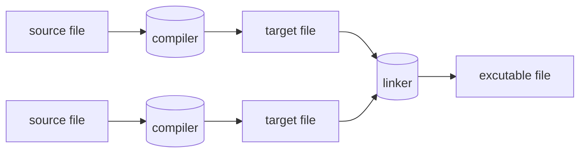

import {To} from '@components'

## 基础知识

C++符号系统，C++内存模型和基本机制。

### 程序
C++是一种编译型语言。为了让程序运行,首先要用编译器处理源代码文本,生成目标文件,然后再用连接器将目标文件组合成可执行程序。一个C++程序通常包含多个源代码文件,通常简称为源文件(source file)。

可执行程序都是为特定的硬件系统组合创建的。不具有可移植性。比如Mac上的程序就无法移植到Windows PC上。当谈论C程序的可移植性时，谈论的是源代码的可移植性。即源代码可以在不同系统上成功编译并运行。

ISO的C++标准定义了两类实体：
1. 核心语言特性(core language feature),例如内置类型(如char和int)和循环(如for语句和while语句);
2. 标准库组件(standard-library component),比如容器(如vector和map)和I/O操作(如\<\<和getline())。

每个C++实现都提供标准库组件，它们其实也是非常普通的C++代码。换句话说，C++标准库可以用C++语言本身实现(仅在实现线程上下文切换这样的功能时才使用少量机器代码)。这意味着C++在面对大多数高要求的系统编程任务时既有丰富的表达力，同时也足够高效。
C++是一种静态类型语言，这意味着任何实体(如对象、值、名称和表达式)在使用时都必须已被编译器了解。对象的类型决定了能在该对象上执行的操作。

## 参考

<To name="Awesome C++" to="https://cpp.libhunt.com"/>
<To name="cppreference.com" to="https://en.cppreference.com"/>
<To name="learncpp" to="https://www.learncpp.com"/>
<To name="代码巴士 - 分享有价值的 C/C++ 知识和源代码" to="https://codebus.cn/"/>
<To name="C语言与C++学习" to="https://github.com/tangtangcoding/C-CppLearning"/>
<To name="C++ Tutorial" to="https://www.javatpoint.com/cpp-tutorial"/>