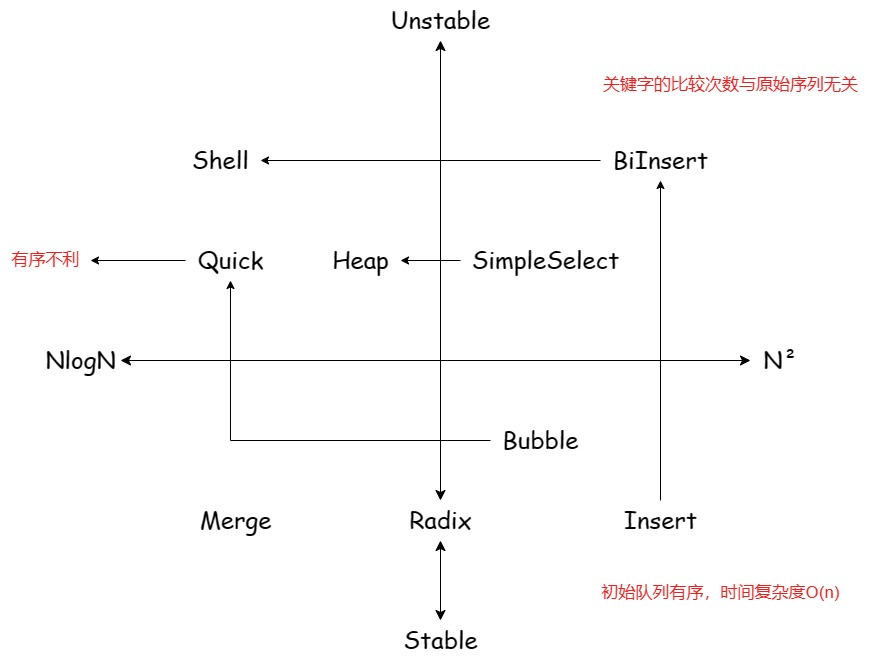
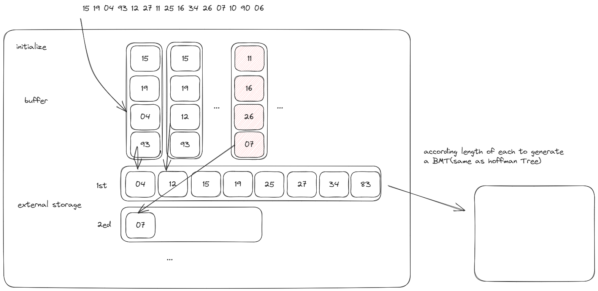

# 排序

# 内部排序

插，换，选，归，基

1. **插入排序**：在最一趟排序前，没有任何关键字到达最终位置

$$
O(n) ~ O(n^2) = O(n^2)
$$
$$
O(n\log_2n) ~ O(n^2) = O(n^2)
$$

缩小增量直接插入排序：无序→基本有序→全局有序

2. **交换排序**

$$
O(n) ~ O(n^2) = O(n^2)
$$
$$
O(\log_2n)
$$
3. **选择排序**

$$
O(n)
$$
$$
O(n\log_2n)
$$
4. **归并排序**

$$
O(n\log_2n)
$$
$$
O(d(n+r_d))
$$
### 排序特性

5. 稳定：直接插入，冒泡交换

6. 不稳定：希尔插入，快速交换，简单选择，堆选择

$$
O(n^2)
$$

7. 空间复杂度快排式log。 归并排序是ON。 基数排序是。 Ord。 其他都是。 O1。

8. 交换类的排序排序趟数和原始序列有关。基本有序时，冒泡交换有利，快速交换不利。

9. 简单选择和折半插入的关键字比较次数和原始序列无关。

10. 与初始排列序列无关的是基数排序。

11. 冒泡交换、快速交换、简单选择，堆选择可以使经过一趟排序能够保证一个关键词到达最终位置。

# 外部排序

12. **置换选择排序**：用于*生成初始归并段*。根据buffer大小初始化归并段。每所有记录都要进行两次`I/O`操作。

13. **最佳归并树**BMT：使用huffman树的构造方法来构造BMT，用于减少归并次数。

